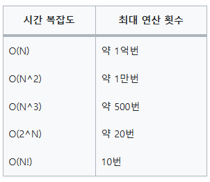

# 코딩 테스트 

### 시간 복잡도는 높히고, 공간 복잡도는 낮추기
시간 복잡도: 알고리즘 성능을 나타내는 지표, 입력 크기에 대한 연산 횟수의 상한.
    
- 일반적인 CPU 기반의 PC나 채점용 컴퓨터에서 1초에 실행할 수 있는 최대 연산 횟수는 약 1억번이다.
- 코딩테스트를 풀 때의 주어지는 숫자의 범위가 중요하다! 예를 들어, N의 최대값이 10만이며, 주어진 제한 시간이 1초라면? 시간 복잡도가 O(N^2)인 알고리즘의 연산 횟수는 10만번*10만번=100억번이므로 사용할 수 없다.

- N의 범위가 500: 시간 복잡도가 O(N^3) 이하인 알고리즘을 설계
- N의 범위가 2,000: 시간 복잡도가 O(N^2) 이하인 알고리즘을 설계
- N의 범위가 100,000: 시간 복잡도가 O(NlogN) 이하인 알고리즘을 설계
- N의 범위가 10,000,000: 시간 복잡도가 O(N) 이하인 알고리즘을 설계
- N의 범위가 10,000,000,000: 시간 복잡도가 O(logN) 이하인 알고리즘을 설계

#### 계획
| 기간     | 내용            |
|--------|---------------|
| 3월 1주차 | 배열 및 문자열      |
| 3월 2주차 | 연결 리스트        |
| 3월 3주차 | 스택과 큐         |
| 3월 4주차 | 해시맵과 해시셋      |
| 4월 1주차 | 정렬 알고리즘       |
| 4월 2주차 | 이진 탐색         |
| 4월 3주차 | 재귀와 백트래킹      |
| 4월 4주차 | 동적 계획법(DP) 입문 |
